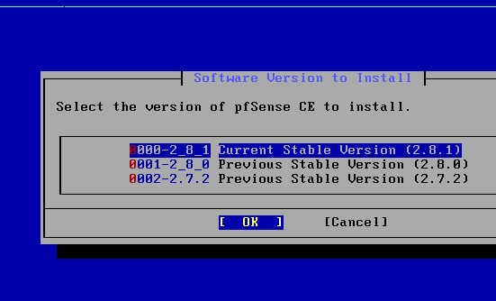
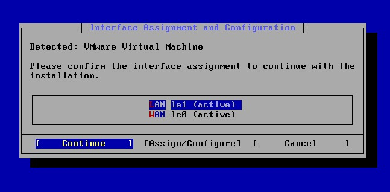
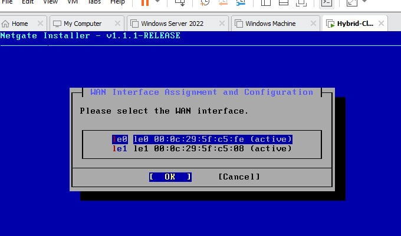
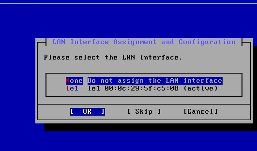
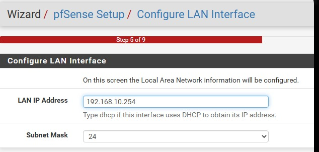
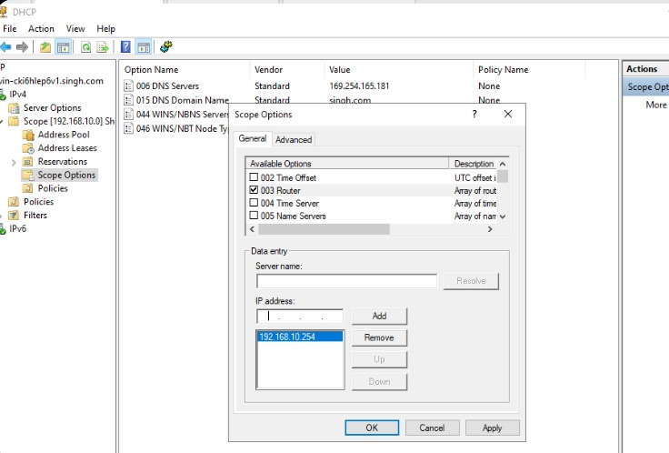
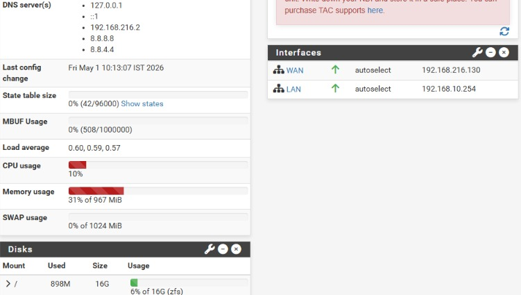
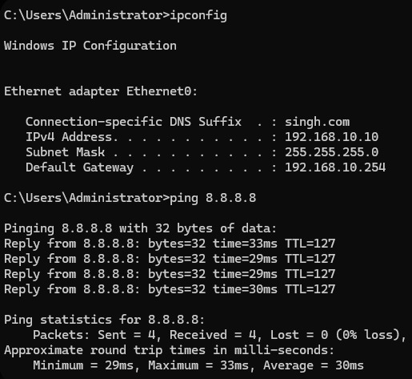

# Phase 1: Hybrid-Gateway Networking & Core Infrastructure

This repository documents the architectural foundation of a Hybrid-Cloud Gateway. The project establishes a secure, routed bridge between an on-premises Enterprise Lab (Windows Server 2022) and an external Cloud-Exit point (pfSense)[cite: 2].

## 🏗️ Virtual Topology
* **Hypervisor**: VMware Workstation Pro (Isolated LAN Segments)[cite: 2].
* **Gateway**: pfSense 2.8.1-RELEASE (Community Edition)[cite: 2].
* **Identity Server**: Windows Server 2022 (`singh.com` domain)[cite: 2].
* **Internal Client**: Windows 11 Enterprise[cite: 2].

---

## 🛠️ Implementation Modules
*Select a module below to view technical configurations and verification receipts.*

<b>Module 1: Installation & VMware Detection</b>

This stage focuses on selecting the correct stable build and ensuring the pfSense kernel correctly identifies the underlying virtualized hardware[cite: 2].

**Technical Highlights:**
*   **Stable Build**: Deployment of **2.8.1-RELEASE** optimized for virtualized environments[cite: 2].
*   **Hypervisor Handshake**: System confirmed successful detection of the **VMware Virtual Machine** environment[cite: 2].

**Implementation Evidence:**
 

 
*Figure 1: Selection of the 2.8.1 stable software branch[cite: 3].*
 

*Figure 2: Kernal confirmation of the VMware virtual environment[cite: 3].*

<b>Module 2: Interface Mapping (WAN/LAN Logic)</b>

Documents the low-level console provisioning where physical interfaces are manually mapped to virtual network segments[cite: 2]. This creates the hard isolation between untrusted WAN and the private LAN.

**Technical Highlights:**
*   **WAN Mapping (`le0`)**: Provisioned for NAT exit to public networks[cite: 2].
*   **LAN Mapping (`le1`)**: Provisioned as the primary gateway for the private subnet[cite: 2].
*   **Static Internal IP**: Defined `192.168.10.254` as the persistent internal exit point[cite: 2].

**Implementation Evidence:**
 

 
*Figure 3: Mapping the untrusted virtual adapter to the WAN interface[cite: 3].*

 
*Figure 4: Mapping the isolated virtual LAN segment to the internal interface[cite: 3].*

<b>Module 3: Enterprise Identity & DHCP Integration</b>

Documents the service integration between pfSense and Windows Server, establishing a professional identity plane and centralized network management[cite: 2].

**Technical Highlights:**
*   **Service Offloading**: DHCP managed exclusively by **Windows Server 2022** for centralized enterprise control[cite: 2].
*   **Routing Instructions**: Scope Option 003 tells all internal devices to use the pfSense address (`.254`) as their gateway[cite: 2].
*   **DNS Resolution**: Internal domain validation for `singh.com`[cite: 2].

**Implementation Evidence:**
 

 
*Figure 5: The initial Web Wizard LAN configuration[cite: 3].*

 
*Figure 6: Domain configuration and host identification (`singh.com`)[cite: 3].*

 
*Figure 7: DHCP scope audit confirming valid gateway and DNS options[cite: 3].*

<b>Module 4: Connectivity Audit & System Audit</b>

Final verification proves the integrity of the network stack, confirming that internal assets can reach the internet while maintaining proper domain credentials[cite: 2].

**Technical Highlights:**
*   **Dashboard State**: Dashboard confirms an optimized build and netgate services active[cite: 2].
*   **DHCP Handshake**: verified client `ipconfig` receives correct addressing[cite: 2].
*   **Transit Proof**: Successful ICMP echo requests (pings) from internal client to public DNS (`8.8.8.8`)[cite: 2].

**Implementation Evidence:**
 

 

 
*Figure 8: Web dashboard confirming healthy WAN and LAN interfaces[cite: 2, 3].*
 

 
*Figure 9: Successful ping tests to 8.8.8.8 from the internal Windows 11 client[cite: 3].*

---

## 💡 Engineering Resolution
By manually architecting the **Interface Mappings** and correctly configuring the **DHCP Scope Options**, I created a collaborative environment between Directory Services and Network Security[cite: 2]. This robust foundation is now ready for **Phase 2: UTM Security Implementation**.

#Cybersecurity #NetworkEngineering #pfSense #ActiveDirectory #HomeLab #WorldSkills2028
