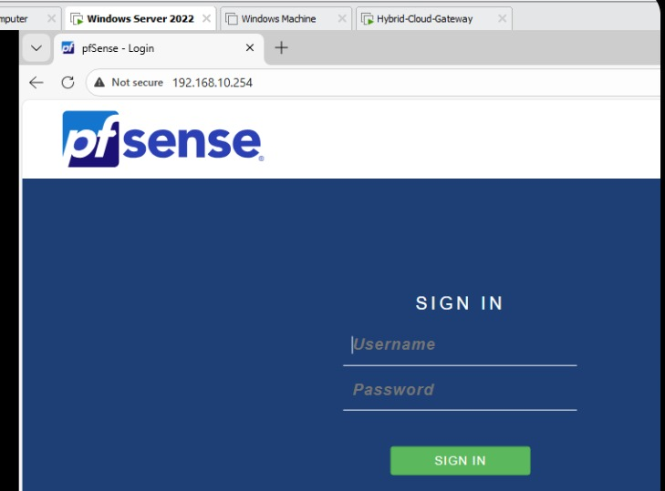
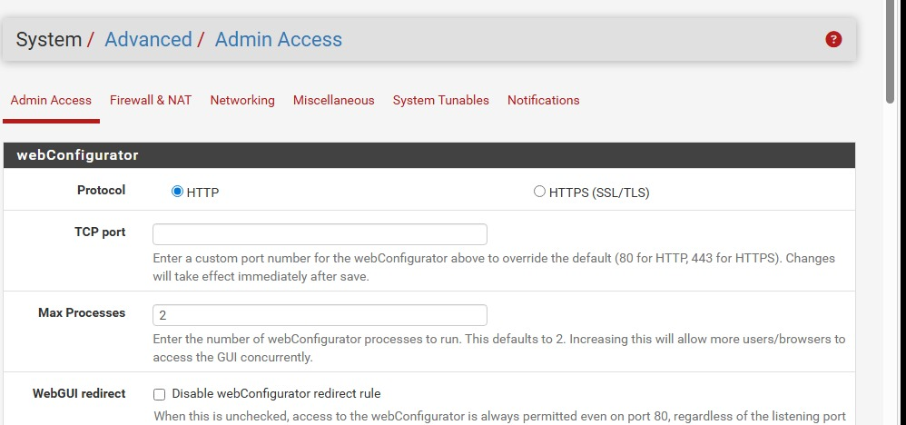
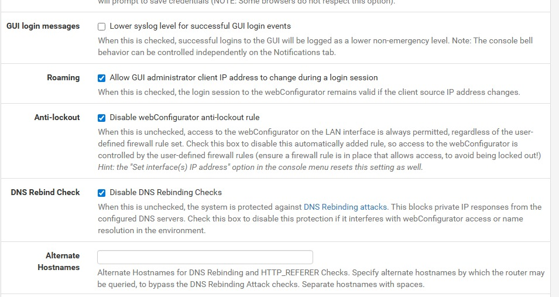
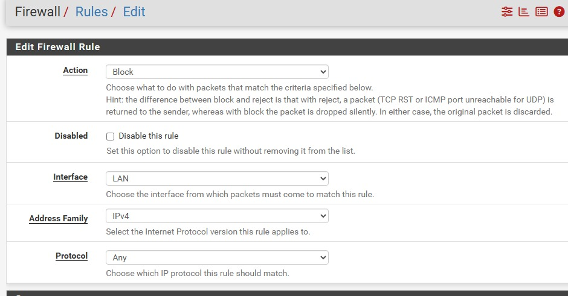
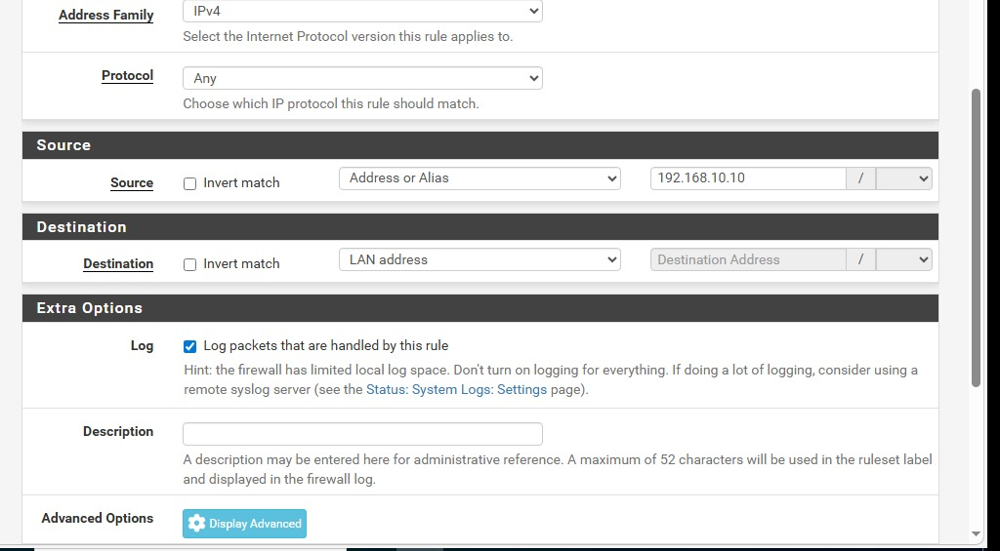
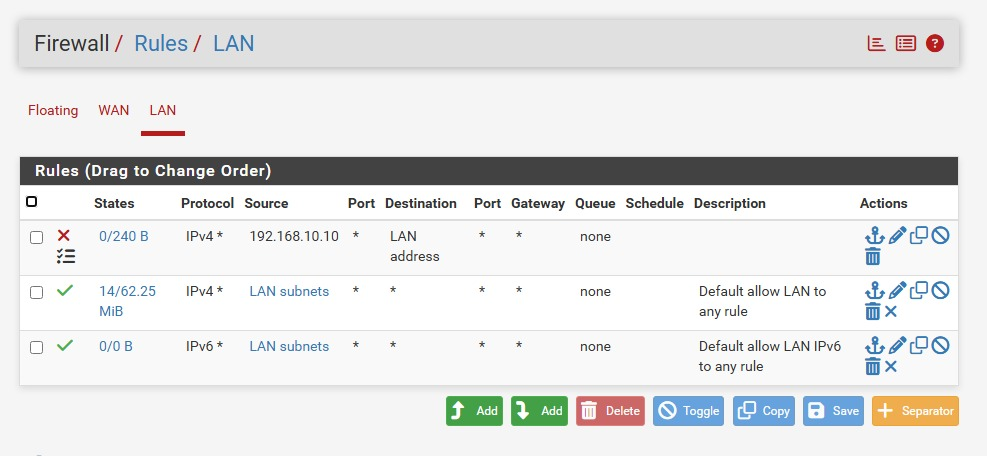
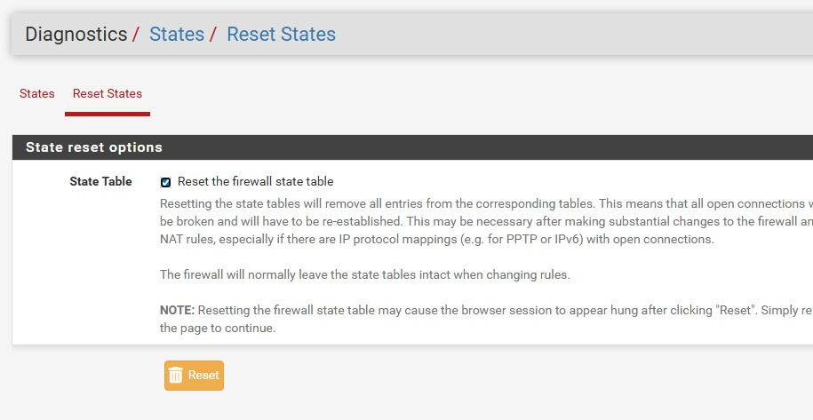
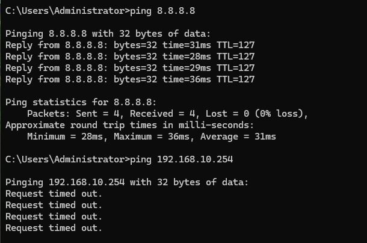

# Phase 2: Security & Traffic Filtration

This phase focuses on hardening the internal network by implementing **Stateful Inspection Rules**, **Management Plane Isolation**, and **Network Stealth**.

---

<b> ## 🛠️ Module 1: Management Plane Isolation </b>

The primary goal of this module is to enforce the **Principle of Least Privilege**. By default, any device on the LAN can access the firewall management interface. We have restricted this access exclusively to the **Windows Server 2022 (Administrative Workstation)**.

### **1. Initial Access & Authentication**
Accessing the pfSense WebGUI from the administrative server for initial configuration.

**Technical Details:**
*   **Gateway IP**: `192.168.10.254`
*   **Protocol**: HTTPS (Port 443)
*   **Target Machine**: Windows Server 2022

 
*Figure 1: Initial secure login to the pfSense gateway from the Windows Server.*

---

### **2. Troubleshooting the "Anti-Lockout" Barrier**
During implementation, a common architectural hurdle was encountered: the built-in **Anti-Lockout Rule**. This rule sits at the top of the stack and prevents custom block rules from taking effect.

> [!NOTE]
> **Troubleshooting Step: Unlocking the Rule Hierarchy**
> If you are unable to move your custom block rules above the default pfSense rules, you must manually disable the built-in safety:
> 1. Navigate to **System > Advanced > Admin Access**.
> 2. Locate the **Anti-lockout** section.
> 3. Check **"Disable webConfigurator anti-lockout rule"**.
> 4. Save and Apply. This allows your custom security policy to take priority.

 

*Figure 1 2: This is where we try move our custome rules above the pfsense rules
 
---

### **3. Implementing the Security Policy**
With the hierarchy unlocked, a broad block rule was implemented to ensure total isolation for the standard user machine.

**Rule Configuration:**
*   **Action**: Block
*   **Protocol**: Any (Ensures no protocol loopholes)
*   **Source**: `192.168.10.10` (Windows 11 Client)
*   **Destination**: LAN Address
*   **Logging**: Enabled to audit blocked attempts

 

 

 

 
*Figure 1 2 3 4: Configuring the specific block rule for the Windows 11 workstation.*

---

### **4. Final Validation & Connectivity Audit**
The final stage confirms that the firewall is "intelligent"—blocking management access while permitting standard internet traffic.

**Verification Results:**
*   **Management Block**: The Windows 11 Client times out when attempting to reach `192.168.10.254`.
*   **Internet Transit**: Successful ICMP echo request (ping) to `8.8.8.8` confirms the user is not completely cut off from the WAN.
*   **Gateway Stealth**: The gateway is hidden from internal pings, preventing network discovery.

 
*Figure 3: Final proof of concept: Internet access is active, but the internal gateway is invisible to the client .*
---

### **Technical Skills Demonstrated:**
*   **Stateful Packet Inspection (SPI)**: Understanding how firewall states affect rule application.
*   **Network Segmentation**: Isolating management traffic from user traffic.
*   **Rule Hierarchy Management**: Overriding default system protections to implement custom security postures.
*   **ICMP Filtration**: Hardening the network against internal reconnaissance.
